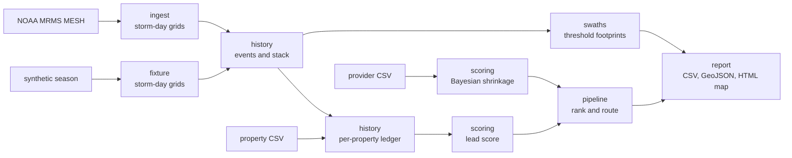

# storm_lead_engine

Turns public NOAA radar hail estimates and a property list into a ranked, explainable list of roofs worth inspecting.

[](https://github.com/maxskrehbiel/storm_lead_engine/actions/workflows/ci.yml)  

## Overview

After a hailstorm, "where did it hail?" is easy to ask. The useful question is harder: which roofs have taken enough hail, on the roof that is there now, to justify an inspection? This engine answers it from two inputs. The first is NOAA's MRMS MESH radar product, which estimates the largest hailstone in every ~1 km cell of the continental United States. The second is a property file you supply. It traces hail-swath footprints at 1.00, 1.50 and 2.00 inch thresholds, builds each property's hail history on its current roof, and ranks properties with a points-based score in which every component is visible. Service providers are ranked with Bayesian shrinkage, so a 5.0 rating from 3 reviews does not outrank a 4.8 from 400. Everything in this repository runs offline on a synthetic storm season and a fictional town.

## Architecture



| Stage | Module | What it does |
|---|---|---|
| 1 | `ingest`, `fixture` | Supply storm-day hail grids on the MRMS 0.01-degree lattice, from the public archive or the bundled synthetic season; the pipeline cannot tell them apart |
| 2 | `history` | Merge consecutive storm days into events, stack them, pin each property to one grid cell and record every hit on its current roof |
| 3 | `swaths` | Trace the cells at or above each threshold into exact GeoJSON polygons, per event and all-time |
| 4 | `scoring` | Compute hail confidence, the property lead score and each provider's shrunk rating |
| 5 | `pipeline` | Rank eligible properties, pick an outreach channel and recommend a provider whose service area covers each one |
| 6 | `report` | Write a ranked CSV, a provider ranking, GeoJSON footprints, a JSON run summary and a static interactive map |

## Quickstart

```bash
git clone https://github.com/maxskrehbiel/storm_lead_engine.git
cd storm_lead_engine
python -m venv .venv
source .venv/bin/activate        # Windows: .venv\Scripts\activate
pip install -e ".[dev]"
storm_lead_engine demo
```

The demo runs offline in a few seconds, writes to `demo_output/` (git-ignored), then grades itself against the synthetic truth it was built from and prints one `check PASS` or `check FAIL` line per check. The committed `examples/` folder holds the same files. Only `storm_lead_engine demo --out examples` rewrites it, and CI does exactly that and fails if anything changed.

| File | Contents |
|---|---|
| `synthetic_leads_top50.csv` | The 50 highest-ranked leads with every score component |
| `synthetic_providers_ranked.csv` | Providers with raw rating, review count and shrunk rating side by side |
| `synthetic_swath_footprints.geojson` | All-time and per-event footprints at each threshold |
| `synthetic_run_summary.json` | Events, footprint areas, counts by status, and parameters used |
| `synthetic_storm_map.html` | Interactive map: hail raster, footprints, leads, providers, summary panel |

## Usage

### Command line

```text
storm_lead_engine demo  [--out DIR] [--seed N] [--n-properties N] [--top N] [--fixture JSON]
storm_lead_engine synth --out DIR [--seed N] [--n-properties N] [--fixture JSON]
storm_lead_engine run   --properties CSV [--providers CSV]
                        [--source fixture|mrms] [--fixture JSON]
                        [--dates YYYY-MM-DD,...] [--bbox=WEST,SOUTH,EAST,NORTH] [--cache-dir DIR]
                        [--as-of YYYY-MM-DD] [--synthetic] [--out DIR] [--top N]
```

- `demo` generates a fictional town and providers, scores them against the bundled storm season, and writes to `--out` (default `demo_output/`). It then checks its own output: storm-day peaks match the fixture, storm days group into the expected events, every lead is eligible, leads are in score order, score components add up, footprints shrink as the threshold rises, and the 4.8-from-400 provider outranks the 5.0-from-3 provider. It exits 1 if any check fails.
- `synth` writes the synthetic inputs (`synthetic_properties.csv`, `synthetic_providers.csv`) so the `run` path can be tried end to end.
- `run` scores your own property file. `--source fixture` (the default) uses the synthetic season. `--source mrms` reads real MESH for the listed storm days and bounding box. It needs network access and the `mrms` extra: `pip install -e ".[mrms]"`. Downloaded windows are cached under `--cache-dir` and are never committed. Write the box as `--bbox=...`, because a value that starts with a minus sign would otherwise be read as a flag.
- `--n-properties` and `--top` must be positive integers (`--n-properties` at most 6000), and `--seed` must be non-negative. `-v` logs progress and `-vv` adds debug detail. `python -m storm_lead_engine ...` is equivalent to the console script.

| Exit code | Meaning |
|---|---|
| `0` | Success |
| `1` | A domain check failed: a demo self-check, or no storm day could be read or reached the storm-day threshold |
| `2` | Usage, configuration or input error (bad argument, invalid CSV or fixture, missing file) |
| `3` | A required optional dependency is missing (rasterio for `--source mrms`) |

Expected errors print one line to stderr, with no traceback. Unexpected errors keep their traceback.

The property file needs `property_id, lat, lon, year_built`. The engine also reads `address, roof_year, assessed_value, owner_occupied, property_type` when present. `roof_year` is the year of the last known roof replacement, for example from permit records. Any other column is dropped at load time and never reaches an output. The provider file needs `provider_id, name, lat, lon, service_radius_km, review_count` and an optional `rating`.

### Python API

```python
import numpy as np

from storm_lead_engine.fixture import load_season, season_day_grids
from storm_lead_engine.pipeline import run_pipeline
from storm_lead_engine.synthetic import generate_properties, generate_providers

season = load_season()  # the bundled synthetic storm season
rng = np.random.default_rng(7)
properties = generate_properties(500, season.origin, season.as_of.year, rng)
providers = generate_providers(season.origin, rng)

result = run_pipeline(
    properties,
    providers,
    season_day_grids(season),
    season.as_of,
    source=season.name,
    synthetic=True,
)
for lead in result.leads[:3]:
    print(lead.rank, lead.property.address, lead.score.score, lead.profile.n_severe)
```

Every threshold and weight lives in a frozen dataclass in `config.py` (`EngineConfig`). Pass `config=EngineConfig(...)` to `run_pipeline` to change them.

## How it works

### Hail data: MESH

**MESH** (Maximum Estimated Size of Hail; Witt et al., 1998) is a radar-derived estimate of the largest hailstone at a location. NOAA's **MRMS** (Multi-Radar Multi-Sensor; Smith et al., 2016) system computes it from reflectivity above the freezing level, merged across radars, on a 0.01-degree grid (about 1.1 km north-south). The engine uses `MESH_Max_1440min`, the maximum over the trailing 24 hours. Raw values are millimetres, and negative values are sentinels for "no radar coverage". They become 0 on a cell, but a storm day that cannot be read at all is reported as missing, never treated as a calm day.

### Storm days and events

A **storm day** `D` is read from the single file stamped 12:00 UTC on `D+1`. Its 24-hour window, 12:00 UTC on `D` to 12:00 UTC on `D+1`, is the convective day the NOAA Storm Prediction Center uses for storm reports. An evening storm that crosses midnight UTC stays in one day, and consecutive days never overlap. A day counts only if its grid reaches 0.75 in somewhere.

An **event** is a run of storm days no more than one day apart. The event grid is the cell-wise maximum over its days, so a two-day storm complex counts once, at its worst.

### Swath footprints

A **footprint** at threshold `T` is the set of cells where an event's hail reached `T`. The three tiers are 1.00 in (quarter-size, the National Weather Service severe criterion and a common rule of thumb for damage to aged asphalt shingles), 1.50 in (ping-pong ball) and 2.00 in (hen egg). Cells are traced into polygons along their exact edges, with holes preserved and exterior rings counter-clockwise as RFC 7946 (Butler et al., 2016) recommends. Nothing is smoothed, so the map shows exactly the cells the scoring used. Area is exact:

```text
cell_area_km2 = (0.01 * 110.574) * (0.01 * 111.320 * cos(latitude))
footprint_area = sum of cell_area over cells with hail >= T
```

### Hail history on the current roof

Each property is pinned to one **anchor cell**: the cell with the largest all-time hail inside a 3x3 window around its coordinates. The window absorbs geocoding error of up to one ~1 km cell. Every event is read from that same cell, so a property's counts and maximum never mix values from different neighbours.

Only hail on the **current roof** counts. The install year is `roof_year` when known, otherwise `year_built`. An event counts only if its year is after the install year. Same-year events are excluded, because a same-year storm is most often why the roof was replaced. Excluded hits are still reported (`pre_roof_severe_events`).

For each property the ledger records how many counted events reached each tier, the largest stone, the worst event and the last severe date. **Hail confidence** (0-100) weights repetition most, because each separate storm is another independent chance to damage the roof:

```text
confidence = 100 * ( 0.20 * min(n_severe / 5, 1)
                   + 0.35 * min(n_damaging / 3, 1)
                   + 0.15 * min(n_extreme / 2, 1)
                   + 0.30 * clamp((max_in - 1.0) / 2.0, 0, 1) )
```

### Lead score

A property is a lead when it is single-family and the hail on its current roof reached 1.00 in. Its score is a weighted sum, and every component is written to the output in points:

```text
score = 100 * ( 0.45 * confidence / 100
              + 0.25 * clamp((roof_age - 5) / 20, 0, 1)
              + 0.15 * sqrt(clamp((value - 75,000) / 675,000, 0, 1))
              + 0.15 * occupancy )          # 1.0 owner-occupied, 0.5 absentee
```

A missing value or occupancy flag scores a neutral 0.5 rather than zero. A gap in the data is not evidence against a property. Owner-occupied leads get the `door_knock` channel and the rest get `mail`. Every non-lead gets a status such as `hail predates current roof` or `type multi_family not targeted`, and `run_summary.json` counts them.

### Provider quality: Bayesian shrinkage

A star average from a handful of reviews is mostly noise. The engine ranks providers by the **Bayesian average**: the posterior mean when prior belief is worth `m` reviews that average `C`:

```text
shrunk_rating = (n * rating + m * C) / (n + m)
```

`n` is the provider's review count. `C` is the review-weighted mean rating across all providers, an empirical Bayes choice in the spirit of Efron and Morris (1975), and `m = 20`. A provider with exactly `m` reviews sits halfway between its own average and `C`. With `C = 4.5`, a 5.0 from 3 reviews shrinks to 4.57, while a 4.8 from 400 reviews stays at 4.79. Providers with no reviews get `C` and are labelled `evidence = none`. The shrunk rating maps linearly from 3.0-5.0 stars onto a 0-100 quality score. Each lead is routed to the best-ranked provider whose service radius covers it and who has at least 5 reviews. A lower confidence bound would rank more conservatively. The posterior mean was chosen because it stays on the star scale and handles zero reviews without a special case.

### Reproducibility and data handling

The pipeline is a pure function of its inputs: no clock, no network, no global random state. Every generator takes an explicit `numpy.random.Generator`, and each fixture storm has its own seed. The core modules never import the synthetic generator; the fixture arrives as storm-day grids, exactly like MRMS data.

Every text artifact is written to be byte-stable across runs and platforms. Files use LF line endings and end with a newline, folium's random element IDs are renumbered in order of appearance, and nothing carries a timestamp. Three details matter for the map. Rasterized hail is quantized to 0.01 mm, so a last-digit floating-point difference cannot change a stored value. The hail image is resampled to Web Mercator by copying whole rows rather than interpolating. The embedded PNG uses stored (uncompressed) deflate blocks, because zlib and zlib-ng compress the same pixels to different bytes. CI regenerates `examples/` and fails on any diff.

The tests check known synthetic ground truth. Each fixture day's peak matches its specified size to within 0.0001 in, the two-day complex becomes one event, and a same-year re-roof removes that storm from the ledger. Network access is blocked in every test except the opt-in integration test.

Input files are treated as untrusted. Only the documented columns are read, and every bad row is reported at once. Text from inputs is HTML-escaped before it reaches the map. A CSV cell that a spreadsheet would evaluate as a formula (leading `=`, `+`, `-` or `@`) is prefixed with an apostrophe.

## Project layout

```text
storm_lead_engine/
├── .github/
│   └── workflows/
│       └── ci.yml
├── examples/                      synthetic demo outputs, checked by CI
├── src/
│   └── storm_lead_engine/
│       ├── __init__.py            package version
│       ├── __main__.py            python -m entry point
│       ├── _types.py              array type aliases
│       ├── checks.py              demo self-checks against the synthetic truth
│       ├── cli.py                 demo, synth and run subcommands; exit codes
│       ├── config.py              frozen dataclasses for every threshold and weight
│       ├── csv_io.py              shared CSV reading, validation and LF writing
│       ├── errors.py              exceptions mapped to exit codes
│       ├── fixture.py             bundled synthetic season as storm-day grids
│       ├── grid.py                HailGrid on the MRMS 0.01-degree lattice
│       ├── history.py             events, stack and per-property ledger
│       ├── ingest.py              NOAA MRMS archive reader
│       ├── pipeline.py            orchestration, ranking and routing
│       ├── properties.py          property schema
│       ├── providers.py           provider schema
│       ├── report.py              CSV, GeoJSON, JSON and HTML outputs
│       ├── scoring.py             hail confidence, lead score, Bayesian shrinkage
│       ├── swaths.py              threshold masks to GeoJSON footprints
│       ├── synthetic.py           seeded storms, fictional town and providers
│       └── fixtures/
│           └── synthetic_season.json
├── tests/                         conftest.py plus a test_<module>.py for every module with logic
├── .editorconfig
├── .gitattributes
├── .gitignore
├── LICENSE
├── README.md
└── pyproject.toml
```

## Development

```bash
pip install -e ".[dev,mrms]"
ruff check .
ruff format --check .
mypy src
pytest --cov=storm_lead_engine --cov-report=term-missing
storm_lead_engine demo --out examples
git diff --exit-code -- examples/
```

`pytest -m integration` runs the one test that reads a real storm day from the public MRMS archive. It is deselected by default, and every other test fails if it touches the network.

## Data

| Source | Kind | Details |
|---|---|---|
| NOAA MRMS `MESH_Max_1440min` | Public | Produced by the U.S. Government (NOAA) and not subject to copyright in the United States. Read from the Iowa State University MTArchive mirror (`mtarchive.geol.iastate.edu`) only when you run `--source mrms`. Nothing downloaded is committed; the cache directory is git-ignored. |
| `fixtures/synthetic_season.json` | Synthetic | Nine invented storms, 2021-2025, described as tracks in kilometres from the town centre and loaded as package data. Not real weather. |
| Properties and providers | Synthetic | Generated by seeded code in `synthetic.py`. Street names are invented, addresses carry no city, state or ZIP code, and there are no owner names. Providers are named `Synthetic Provider NN` and carry only an aggregate rating and a review count. |

The demo sits at latitude 0, longitude 0, in open ocean, and the map has no basemap. No synthetic point corresponds to real land, and viewing the map requests no map tiles. Everything in `examples/` is synthetic and prefixed `synthetic_`, and the HTML map shows a banner saying so. The map is rendered with Leaflet via folium.

## Limitations

- MESH is a radar estimate, not a ground observation. It can overstate or understate stone size. There is no cross-check against spotter reports yet.
- At ~1 km resolution, every property in a cell shares one history. The 3x3 anchor window leans toward the worst neighbouring cell, so it favours inclusion over exclusion.
- Without a `roof_year`, roof age falls back to `year_built`. That overstates the age of roofs replaced without a record. The `roof_age_source` column flags which rows rely on it.
- Roof replacement is known only to the year. The same-year exclusion is a heuristic.
- The weights and thresholds are stated defaults, not parameters fitted to inspection outcomes. They live in `EngineConfig` so they can be changed and tested.
- Wind damage, roof material and roof slope are not modelled.
- Shrinkage corrects for small samples. It does not detect inflated or unrepresentative ratings.
- The MRMS reader depends on the archive's directory layout. It is covered by tests with mocked HTTP and an in-memory raster, plus one opt-in live test.
- The demo runs on an abstract plane at 0, 0, so its map has no geographic context. Real runs place properties wherever their coordinates are.
- The output is a prioritization aid, not an insurance, engineering or damage determination.

## References

- Butler, H., M. Daly, A. Doyle, S. Gillies, S. Hagen and T. Schaub, 2016: The GeoJSON Format. RFC 7946, Internet Engineering Task Force.
- Efron, B., and C. Morris, 1975: Data analysis using Stein's estimator and its generalizations. *Journal of the American Statistical Association*, 70(350), 311-319.
- Smith, T. M., and coauthors, 2016: Multi-Radar Multi-Sensor (MRMS) severe weather and aviation products: Initial operating capabilities. *Bulletin of the American Meteorological Society*, 97(9), 1617-1630.
- Witt, A., M. D. Eilts, G. J. Stumpf, J. T. Johnson, E. D. Mitchell and K. W. Thomas, 1998: An enhanced hail detection algorithm for the WSR-88D. *Weather and Forecasting*, 13(2), 286-303.

## License

MIT © Maxwell Krehbiel. See [LICENSE](LICENSE).
